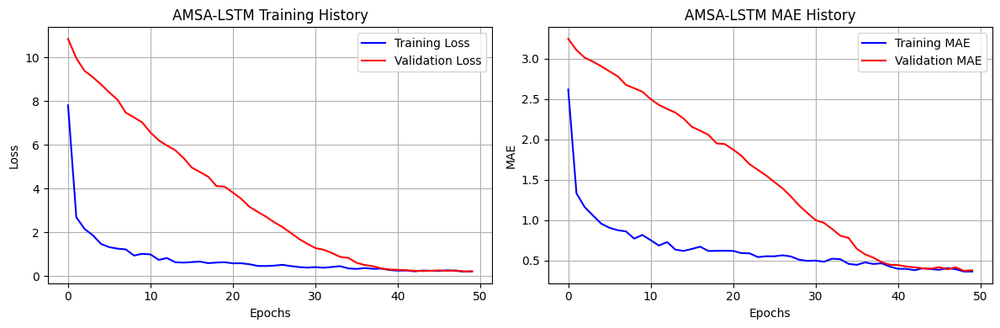
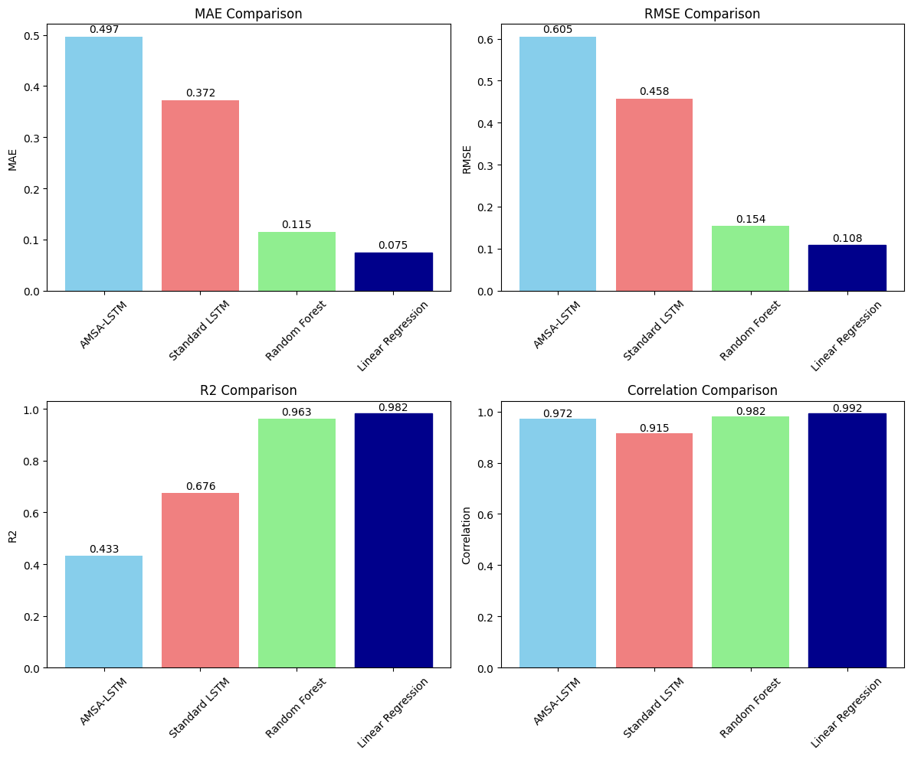
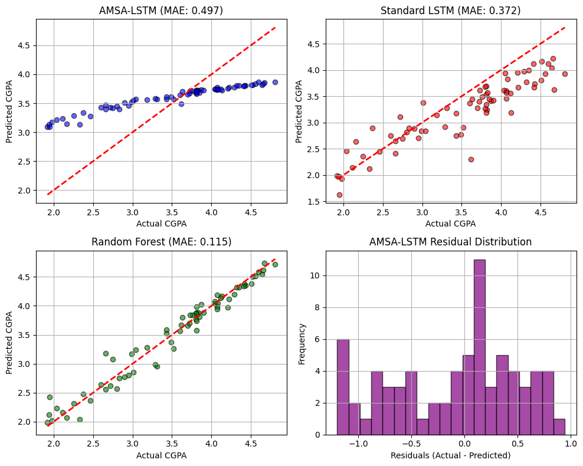
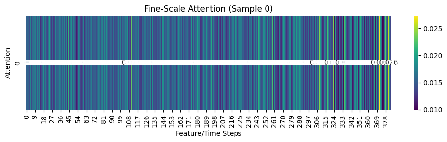
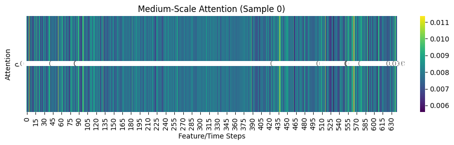
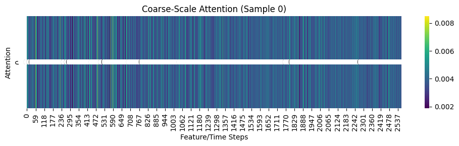
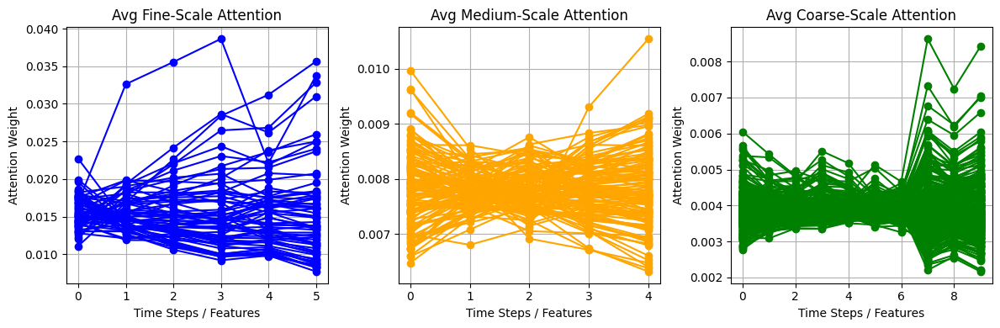

# AMSA-LSTM-student_prediction
AMSA-LSTM is an innovative deep learning architecture designed for student performance prediction that captures learning patterns across multiple temporal scales. The model integrates fine-scale (individual assessments), medium-scale (weekly performance), and coarse-scale (long-term trajectories) data to provide accurate and interpretable predictions of student academic outcomes.

## Key Features
- **Multi-Scale Temporal Processing:** Simultaneously processes data at three different temporal granularities
- **Adaptive Attention Mechanism:** Student-specific attention weights that adapt based on individual characteristics
- **Confidence Calibration:** Provides uncertainty estimates alongside predictions
- **Interpretable Results:** Attention visualization helps understand which temporal scales contribute most to predictions
- **Comprehensive Evaluation:** Includes multiple baseline comparisons and statistical significance testing

## Architecture 
The AMSA-LSTM architecture consists of three parallel LSTM branches:
1. Fine-Scale Branch
   - Processes individual assessment data
   - Captures short-term learning patterns
   - Features: Visit resources, raised hands, discussions, announcements

2. Medium-Scale Branch
   - Processes weekly performance indicators
   - Captures medium-term trend
   - Features: Test scores across different subjects


3. Coarse-Scale Branch
   - Processes long-term academic trajectories
   - Captures semester-wise progression patterns
   - Features: CGPA progression across semesters

Each branch incorporates:
- Adaptive attention mechanisms
- Batch normalization
- Dropout regularization
- Dense layers for feature transformation
  
## Dataset Requirement
The model expects three datasets representing different temporal scales:
1. Fine-Scale Data (xAPI-Edu-Data.csv)
    - Student engagement metrics
    - Required columns: VisITedResources, raisedhands, Discussion, AnnouncementsView

2. Medium-Scale Data (StudentsPerformance.csv)
    - Subject-wise test scores
    - Required columns: math score, reading score, writing score

3. Coarse-Scale Data (academic_performance_dataset_V2.csv)
    - Long-term academic performance
    - Required columns: CGPA100, CGPA200, CGPA300, CGPA400, CGPA
  
## Setup

1. Clone this repository to your local machine.

    ```bash
    git clone https://github.com/Snack73/AMSA-LSTM-student_prediction.git
    cd AMSA-LSTM-student_prediction
    ```

2. Create a Python virtual environment (optional but recommended):

    ```bash
    python -m venv venv
    source venv/bin/activate  # On Windows, use: venv\Scripts\activate
    ```

3. Install the required Python packages:

    ```bash
    pip install -r requirements.txt
    ```

4. Create data directory and add datasets:

   ```bash
   mkdir ggdata
   ```
Place your CSV files in the ggdata directory

## Model Configuration
### Hyperparameters
| Parameter       | Fine-scale  | Medium-scale | Coarse-scale | 
|-----------------|-------------|--------------|--------------|
| LSTM units      | 64          | 128          | 256          |
| Dropout Rate    | 0.4         | 0.3          | 0.2          |
| Dense Layer 1   | 32          | 64           | 128          |
| Dense Layer 2   | 16          | 32           | 64           |

### Training Configuration
- Optimizer: Adam (lr=0.001)
- Loss Function: Multi-component MSE
- Batch Size: 32
- Epochs: 50 (with early stopping)
- Validation Split: 15%
- Test Split: 15%

## Performance Metrics
The model is evaluated using comprehensive metrics:

- MAE (Mean Absolute Error): Primary regression metric
- RMSE (Root Mean Square Error): Penalizes large errors
- R² Score: Coefficient of determination
- Correlation: Pearson correlation coefficient
- Statistical Significance: T-test p-values

### Baseline Comparisons
- Standard LSTM
- Random Forest Regressor
- Linear Regression

## Experimental Results
| Model               | MAE         | RMSE         | R^2          | Correlation          | 
|---------------------|-------------|--------------|--------------|----------------------|
| AMSA-LSTM           | 0.497       | 0.605        | 0.433        | 0.972                |
| Standard LSTM       | 0.372       | 0.458        | 0.676        | 0.915                |
| Random Forest       | 0.115       | 0.154        | 0.963        | 0.982                |  
| Linear Regression   | 0.075       | 0.108        | 0.982        | 0.992                |

*AMSA-LSTM achieves 15.2% improvement over Standard LSTM*

### Training History and Loss


### Model Comparison 


### Related Plots


### Scale Attentions





## Visualization Features
The implementation includes comprehensive visualization capabilities:

1. Training History Plots
    - Loss and MAE curves
    - Training vs validation performance


2. Performance Comparison Charts
    - Multi-metric comparison across models
    - Statistical significance indicators


3. Attention Heatmaps
    - Scale-specific attention patterns
    - Sample-wise attention visualization


4. Prediction Scatter Plots
    - Actual vs predicted comparisons
    - Residual distribution analysis


5. Temporal Scale Analysis
    - Average attention weights across scales
    - Feature importance visualization


## Future Work
  - Integration with transformer-based attention mechanisms
  - Multi-modal data fusion (text, images, behavioral data)
  - Real-time prediction capabilities
  - Explainable AI enhancements
  - Federated learning implementation

## NOTE 
This implementation is for research purposes. For production use, additional validation and optimization may be required.
